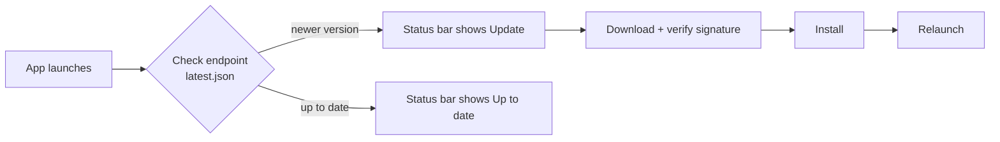

# Auto-updater

The desktop app ships with Tauri's [updater plugin](https://v2.tauri.app/plugin/updater/).
On launch (and every 6 hours) it checks the latest GitHub release for a newer,
signed build and offers the user a one-click download-and-restart.

## How it works



- **Endpoint** — `plugins.updater.endpoints` in
  [`src-tauri/tauri.conf.json`](../src-tauri/tauri.conf.json) points at
  `https://github.com/<owner>/<repo>/releases/latest/download/latest.json`.
- **Signature verification** — every downloaded package must be signed with the
  private key that matches `plugins.updater.pubkey`. This prevents installing a
  tampered or spoofed update.
- **UI** — a always-visible status-bar control
  (`DesktopUpdateFooterControl` in the shared Layout) opens a popover for check /
  skip / install / restart, plus a searchable catalog of published versions so
  users can install (or downgrade to) any release that ships `latest.json`.
  Headless logic lives in
  [`src/components/DesktopUpdaterController.tsx`](../src/components/DesktopUpdaterController.tsx);
  plugin calls live in [`src/lib/updater.ts`](../src/lib/updater.ts); shared state is
  `useDesktopUpdaterStore`. Installing a non-latest tag uses the custom
  `check_desktop_update_for_tag` command, which points the updater at that
  release’s `latest.json` while reusing the plugin’s signed download/install path.
- **Native wiring** — the `updater` and `process` plugins are registered in
  [`src-tauri/src/main.rs`](../src-tauri/src/main.rs) and permissioned in
  [`src-tauri/capabilities/default.json`](../src-tauri/capabilities/default.json).

## One-time setup

### 1. Generate a signing keypair

From `apps/desktop`:

```bash
bun run updater:keygen
```

This runs [`scripts/generate-updater-key.ts`](../scripts/generate-updater-key.ts),
which:

- writes the private key to `.tauri-updater.key` (git-ignored),
- writes the public key to `.tauri-updater.key.pub`,
- injects the public key into `plugins.updater.pubkey` in `tauri.conf.json`.

To use a key password (recommended), run `bun run updater:keygen --password`
and you'll be prompted for one.

> ⚠️ Back up the private key and password somewhere secure (a password manager
> or secret vault). If you lose them you can no longer publish updates that
> existing installs will accept — you'd have to ship a rebuilt app with a new
> public key first.

### 2. Add the CI secrets

The [`ci.yml`](../../../.github/workflows/ci.yml) workflow signs
release artifacts with these repository secrets:

| Secret | Value |
| --- | --- |
| `TAURI_SIGNING_PRIVATE_KEY` | Contents of `.tauri-updater.key` |
| `TAURI_SIGNING_PRIVATE_KEY_PASSWORD` | The key password (empty if none) |

Using the GitHub CLI from `apps/desktop`:

```bash
gh secret set TAURI_SIGNING_PRIVATE_KEY < .tauri-updater.key
gh secret set TAURI_SIGNING_PRIVATE_KEY_PASSWORD   # paste the password, or leave empty
```

### 3. Verify the endpoint

Confirm the `endpoints` URL in `tauri.conf.json` points at the repository that
publishes releases. It must match the repo `ci.yml` desktop releases to.

## Publishing an update

1. Bump the **base** version in `apps/desktop/package.json` and
   `apps/desktop/src-tauri/tauri.conf.json` (and `Cargo.toml`) when you want a
   new marketed release line (e.g. `1.3.3` → `1.3.4`). Keep them in sync.
2. Push to `main` (or tag/push). The `ci.yml` workflow appends the short
   git SHA as a SemVer prerelease, so `latest.json` gets a unique version such
   as `1.3.3-a4b0436`. (A fourth dotted segment like `1.3.3.a4b0436` is not
   valid SemVer and cannot be used with Tauri's updater.)
3. The workflow builds every platform, signs the bundles, and attaches the
   platform installers plus a `latest.json` manifest to the GitHub release.
   `latest.json` is what the updater reads.

Installed apps will detect the release on their next check and prompt to update
whenever the remote version string differs from the installed one.

## Rotating the key

If the private key is compromised, rotate it:

```bash
bun run updater:keygen --force
```

Then update the CI secrets (step 2) and ship a new release. Note that clients
still running a build with the **old** public key cannot verify updates signed
with the new key — they must be updated to the new-key build through another
channel (e.g. a fresh download) before auto-update resumes.

## Local testing

The updater only runs inside the packaged desktop shell (it is a no-op in
`vite dev`). To test end to end:

1. Build and install a release stamped as `x.y.z-<sha1>`.
2. Publish another commit so CI produces `x.y.z-<sha2>` (or bump the base
   version).
3. Launch the installed app — the update dialog should appear within a few
   seconds.

## Troubleshooting

- **"You are up to date" but a newer SHA release exists** — SemVer ranks
  prereleases *below* the matching release. An install of plain `1.3.3` will
  never see `1.3.3-<sha>` as newer. Bump the **base** version (e.g. to
  `1.3.4`) so CI stamps `1.3.4-<sha>`, which is greater than `1.3.3`. New
  builds also use an inequality comparator / `allowDowngrades` so any
  different remote version is offered once that code is installed.
- **No dialog appears** — confirm a release newer than the installed version
  exists and that its assets include `latest.json`. Check the app logs for
  updater errors.
- **"signature verification failed"** — the `pubkey` in `tauri.conf.json`
  doesn't match the private key used to sign the release. Regenerate/sync with
  `bun run updater:keygen` and re-sign the release.
- **CI didn't produce `latest.json`** — ensure `createUpdaterArtifacts: true` is
  set under `bundle` in `tauri.conf.json` and that both signing secrets are
  present in the workflow environment.
